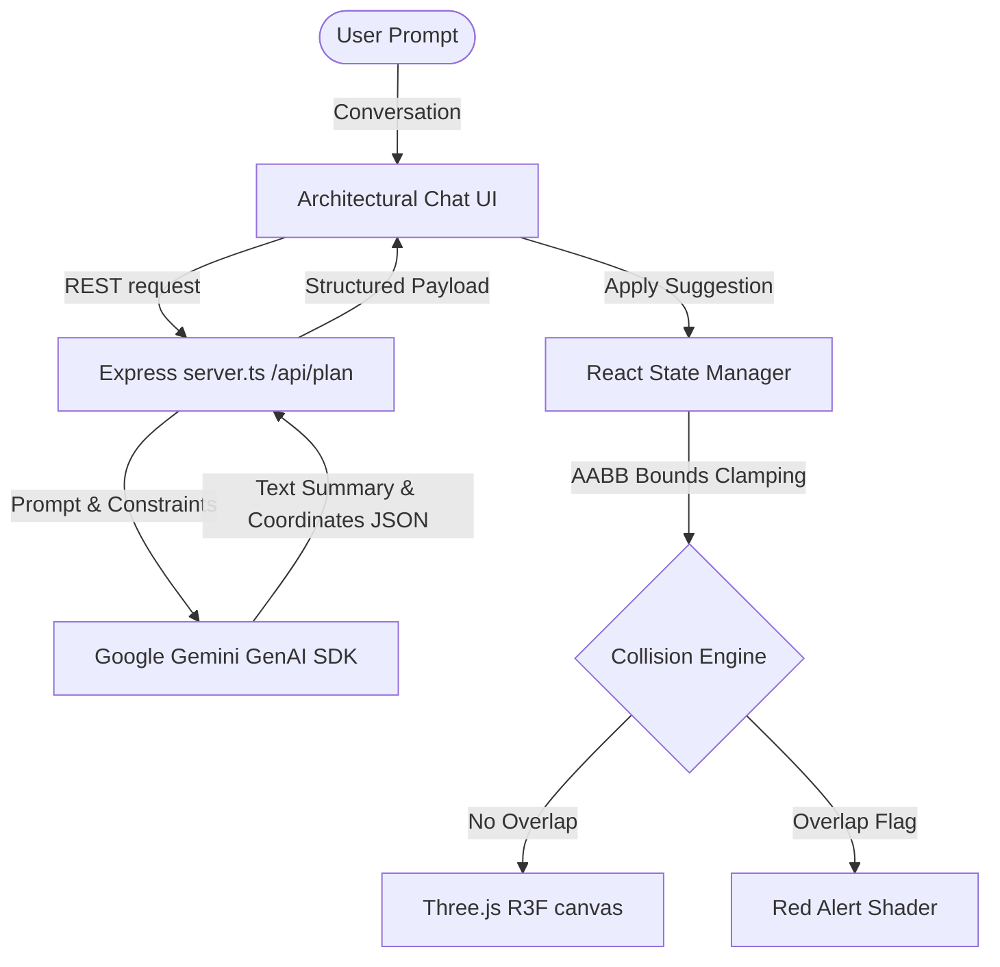

# 🏗️ StudioPlanner — High-Fidelity 3D Micro-Apartment & Dorm Planner
> **An Intelligent Spatial Architecture Engine** powered by React, Three.js, and Google Gemini AI. Design, simulate, and optimize high-density student housing, hostel dorms, and micro-apartments in real-time with physical precision.

[](#)
[](#)
[](#)
[](#)
[](#)

---

## 🚀 The Core Vision: Space Optimization at Scale

Designing student accommodation or micro-apartments is a high-dimensional puzzle. Maximizing occupant density while preserving **circulation pathways, architectural boundaries, and user privacy** requires careful spatial reasoning.

### Problem vs. Solution

| The Spatial Problem | Our Intelligent Solution |
| :--- | :--- |
| **AABB Inefficiencies**: Standard simple drag-and-drop designers ignore complex wall partitions, columns, and real-time collision boundaries. | **AABB Bounds Solver**: Computes real-time axis-aligned collision meshes and restricts drag positions to valid structural coordinates. |
| **Flat, Boring Graphics**: Standard web design tools lack spatial realism, depth cues, and realistic surface lighting. | **PBR Procedural Shaders**: Procedurally generates oak hardwood grain, steel brushed lines, fabric weaves, and glass reflections. |
| **Manual Guestimating**: Humans struggle to solve optimal arrangements for varying occupancies (e.g. "Fit 6 residents"). | **Generative AI Architect**: Integrates Google Gemini model to convert conversational occupancy specs into exact 3D coordinates. |

---

## 🎨 Immersive Feature Highlights

### 1. Ultra-Realistic Procedural PBR Shading
Every model in StudioPlanner is styled with dedicated physical parameters (`MeshPhysicalMaterial`), completely bypassing low-fidelity flat colors:
*   **Hardwood Flooring**: Custom canvas shader renders Oak floorboards with variable grain lines, knots, and high specular reflection.
*   **Brushed Steel**: Polished micro-scratches on wardrobes and frame structures reflect Lightformer environment nodes.
*   **Fabric Canvas**: Weave mapping on swivelling desks and bunk bed mattresses creates genuine textural depth.
*   **Travertine Bathroom Tiling**: High gloss, clean grout-lined tiling reflecting directional light sources.

### 2. Interactive Mechanical Animations
Rather than static blocks, elements respond physically to interactions:
*   **Swinging Mahogany Door**: Entrance door pivots open on click and automatically opens when switching to POV exploration.
*   **Sliding Frosted Glass Partition**: Elegantly slides aside with smooth deceleration to reveal the luxury bath zone.
*   **Spinning Ceiling Fan**: Aerodynamic angled blades rotate smoothly via delta-timed frame loops.
*   **Activated Faucets & Showers**: Activates streaming water columns and real-time gravity-based falling droplets particle systems.
*   **Study Table Detail**: Opens and closes laptop lids with glowing screens, alongside a steaming hot coffee mug.

### 3. Dual-Mode Viewports (Orbit & First-Person POV)
*   **Interactive Draft**: Grid-aligned orthographic/perspective editor to manipulate, rotate, and position furniture.
*   **Immersive Walk**: Switch into First-Person POV to wander the room using WASD/Keyboard or the **floating analog touch Joystick** with authentic head-bobbing walk physics.

---

## 🧬 Architecture & Intelligence Flow

StudioPlanner coordinates conversational user prompts, backend spatial planning AI, and full WebGL fiber rendering.



---

## 📦 Tech Stack & Dependencies

The system is built as a highly performant full-stack Node/TypeScript single-page bundle:

*   **Frontend Library**: `React 19.2.3`
*   **Build Tool & Dev Server**: `Vite 6.2.0`
*   **3D Render Engine**: `@react-three/fiber ^9.4.2` & `Three.js ^0.182.0`
*   **Helper Hooks & Geometry**: `@react-three/drei ^10.7.7`
*   **Generative AI Orchestration**: `@google/genai ^1.34.0` (Server-side proxy proxying API keys securely)
*   **Icons**: `lucide-react ^0.562.0`

---

## 🛠️ Installation & Setup Guide

Get your professional 3D workspace running locally in seconds.

### Prerequisites
*   Node.js (v18.0 or higher recommended)
*   npm or yarn

### 1. Clone the Repository
```bash
git clone https://github.com/rahulcvwebsitehosting/StudioPlanner.git
cd StudioPlanner
```

### 2. Install Project Dependencies
```bash
npm install
```

### 3. Configure the Environment
Create a `.env` file in the root directory and append your secure Gemini API credentials:
```env
# .env
GEMINI_API_KEY=your_gemini_api_key_here
```

### 4. Run Development Server
Boot the Express back-end proxy with Vite HMR client-side hot-loading:
```bash
npm run dev
```
Open [http://localhost:3000](http://localhost:3000) in your web browser.

### 5. Production Build & Compile
Compile the backend TypeScript server into a high-performance bundled standalone file, and compile client assets into statically optimized files:
```bash
npm run build
npm start
```

---

## 🧑‍💻 Engineering & Development Leadership

StudioPlanner is designed, coded, and maintained by:

### **Rahul Shyam**
*Lead Full-Stack Web3D Architect & Developer*

[](https://linkedin.com/in/rahulshyamcivil)
[](https://github.com/rahulcvwebsitehosting)

*Reach out for custom WebGL engineering, interactive spatial planners, or AI integration consultation.*
